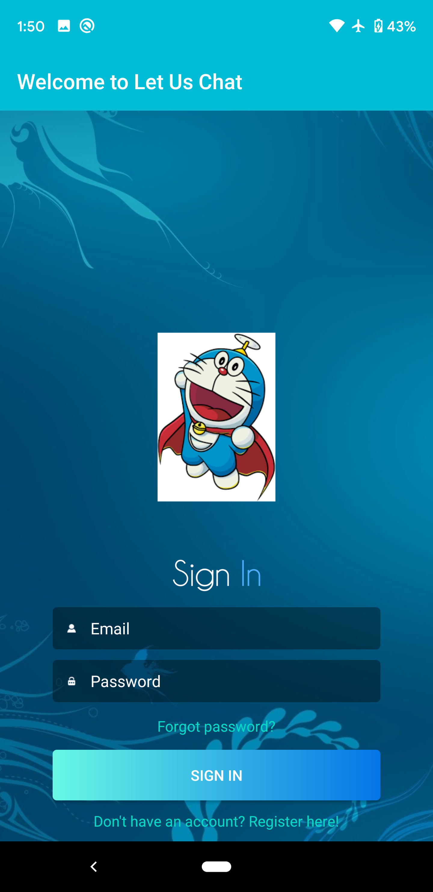
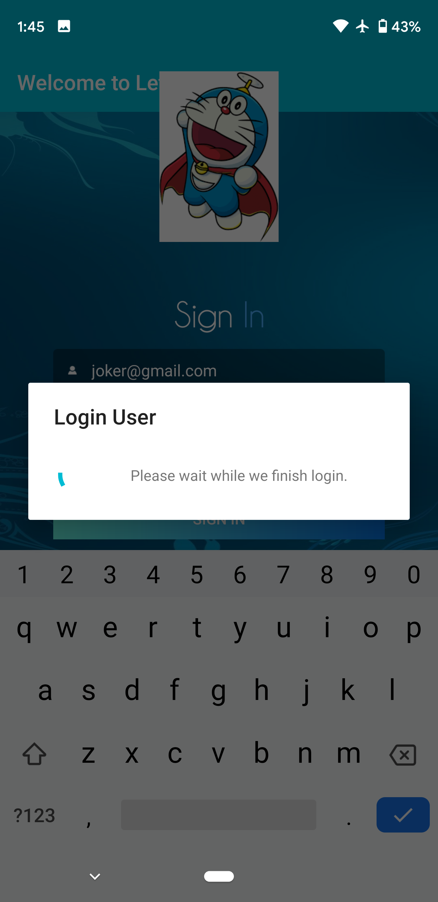
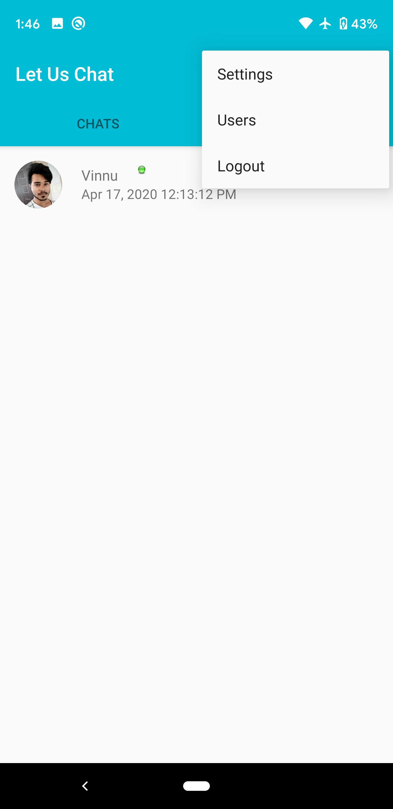
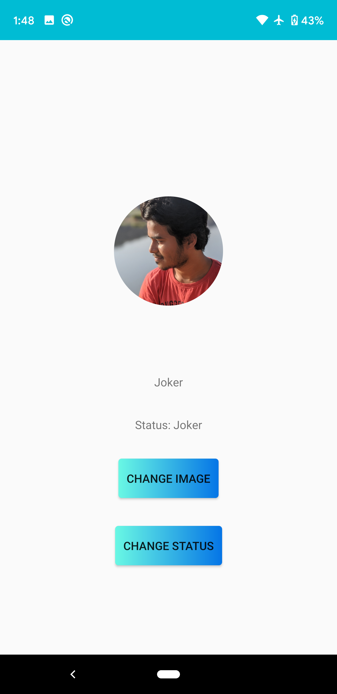
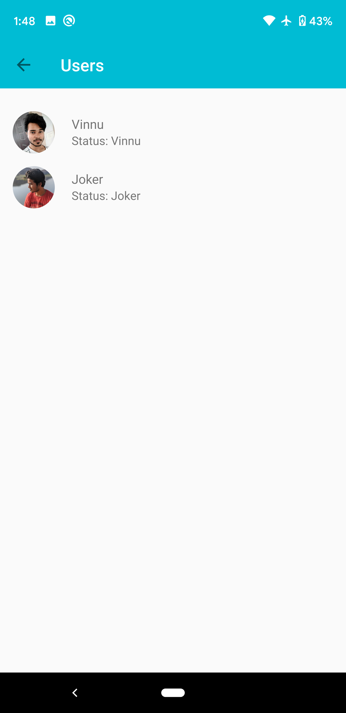
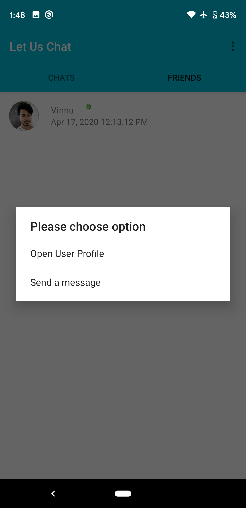
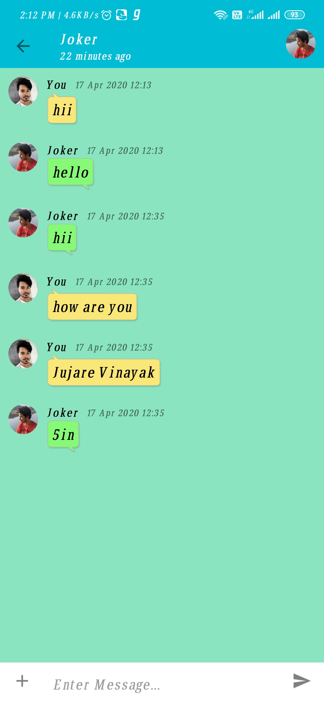

# FirebaseChatApp
 Here is the app "Let us Chat". A Chat Application demo project.
 Features:
1. User Authentication.
2. Setting Profile Pic.
3. Setting Status.
4. One to One Chat.
5. Lastseen.
6. Friend Request Notifications.
7. Friends Tab
8. Chats Tab

Prerequisite:
1. Create an account in firebase console.
2. Create your project in firebase.
3. Make sure you connected to firebase. Tools -> Firebase.
4. Connect your app to Firebase in Tools -> Firebase, for Authentication, Realtime Database, Storage. Cloud Function for firebase.
5. Mostly importantly add required gradle dependencies for firebase with compatible versions of firebase.
6. For friend request notification I have used node.js in backend firebase functions.
a. Install node.js
b. Run the commands in path where you want to download:
i.   npm install -g firebase-tools
ii.  firebase login
iii. firebase init
iv.  select functions with your app selected and start download.
c. Open Your_FireBase_Path\notificationFunction\functions\index.js. Modify index.js file. Its there in path FirebaseChatApp/app/index.js
7. Cleared google-services.json for security purposes.
8. Take care of Run time permissions

Images Details:
1. Login_Page
2. Login_Progress
3. Chats_Tab
4. Friends_Tab
5. Menu
6. Profile_Activity
7. Users_Activity
8. Dialog_Options(Open User Profile, Send a message)
9. Chat_Activity_User1
10. Chat_Activity_User2

