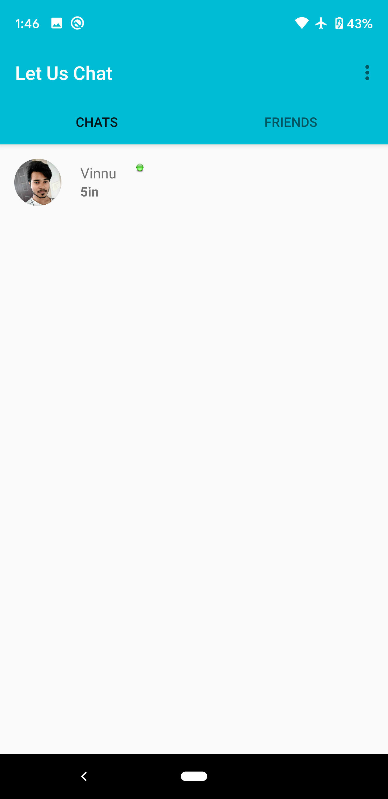
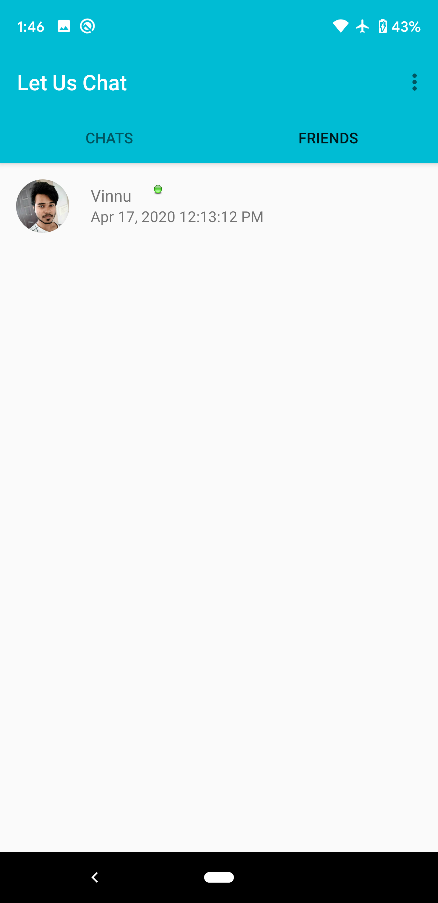

# FirebaseChatApp
 Here is the app "Let us Chat". A Chat Application demo project.
 Features:
1. User Authentication.
2. Setting Profile Pic.
3. Setting Status.
4. One to One Chat.
5. Lastseen.
6. Friend Request Notifications.
7. Friends Tab
8. Chats Tab

Prerequisite:
1. Create an account in firebase console.
2. Create your project in firebase.
3. Make sure you connected to firebase. Tools -> Firebase.
4. Connect your app to Firebase in Tools -> Firebase, for Authentication, Realtime Database, Storage. Cloud Function for firebase.
5. Mostly importantly add required gradle dependencies for firebase with compatible versions of firebase.

